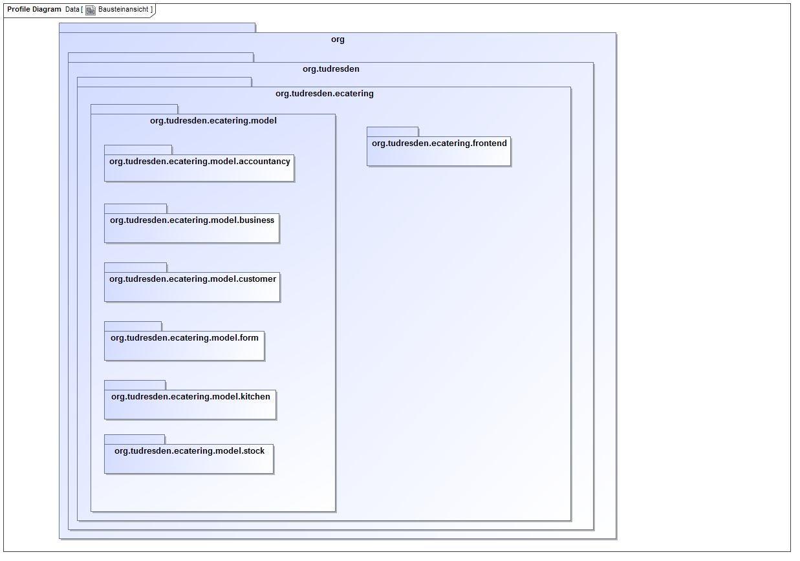

= Entwicklerdokumentation

== Einführung und Ziele

* Die Best-Food-Catering GmbH & Co. KG ist ein aufstrebender Betrieb der sich auf die besonderen Anforderungen der Essensbelieferung von Kindertagesstaetten und Gross-Unternehmen spezialisiert hat. Aufgrund des gestiegenen Interesses an Kinderbetreuung in den alten Bundeslaendern ist die Betriebsorganisation für ein deutliches Wachstum auszugestalten und dies beinhaltet eine Software-Technische Lösung. Innerbetrieblich sind die drei Bereiche Küche, Debitorenbuchhaltung und Lagerhaltung zu nennen und als Schnittstelle zu den Kunden das Online-Bestellsystem. Für die Küche ist ein täglicher Bericht notwendig. Der Bericht muss alle zu kochenden Essen enthalten mit Anzahl und Rezepten. Dabei können je Essen jeweils unterschiedliche Portionierungen auftreten, da Kita-Kinder eine kleinere Portion bekommen als Mitarbeiter eines Gross-Unternehmens. In der Debitorenbuchhaltung werden alle Kundendatensätze verwaltet und deren Zahlungsforderungen bearbeitet. Kindertagesstätten können dabei zwischen zwei Abrechnungsmodellen wählen; der Einzel- und der Gruppenabrechnung. In der Gruppenabrechnung werden alle an die Kindertagesstätte gelieferten Essen als Ganzes in Rechnung gestellt und die ErzieherInnen sammeln bei den Eltern das Geld selber ein. Aufgrund des geringeren Verwaltungsaufwandes wird diesen Tagesstätten dann einen Rabatt von 7% auf den Netto Rechnungspreis gewährt. Gross-Unternehmen können nur eine Einzelabrechnung machen. In der Einzelabrechnung wird direkt mit den Eltern der Kinder bzw. den Mitarbeitern der Gross-Unternehmen abgerechnet. Eine entsprechende Rechnung wird im Online-System angezeigt. Unabhängig von den Abrechnungsmodellen kann jeder Debitor zwischen Lastschrift und Überweisung wählen. Die Abwicklung und Kontrolle des Geldtransfers liegen in alleiniger Verantwortung der Best-Food-Catering GmbH & Co. KG und nicht im Aufgabenfeld des hier beschriebenen Software-Systems. In der Lagerhaltung müssen alle Zutaten für die Herstellung verwaltet werden. Dabei ist für verderbliche Produkte das Mindesthaltbarkeitsdatum zu beachten und grundsätzlich nach dem FIFO Prinzip vorzugehen. Wöchentlich wird ein Bericht benötigt der alle Nachbestellungen auflistet; auf Basis des Speiseplans. Sollten im Lager Waren sein, deren Haltbarkeit abgelaufen ist, müssen diese automatisch aus dem System entfernt werden und der Lagerist muss informiert werden. Zur Sicherung einer ausgewogenen Ernährung wird der Speiseplan immer mindestens zwei Wochen im Voraus veröffentlicht. Die Veröffentlichung erfolgt online im System, nicht via Newsletter o.ä. Die Eltern oder Mitarbeiter können dann im Online-System das Essen bestellen. Frist für die Essensbestellung durch den Kunden ist eine Woche im Voraus. Eine nachträgliche Änderung einer abgeschlossenen Bestellung ist nicht vorgesehen. Zur Vereinfachung der Küchen-Logistik existieren immer drei Menu-Linien. Die erste Menu-Linie sind die Normal-Esser. Für Menschen mit Unverträglichkeiten gibt es als zweite Menu-Linie die Diätkostler und als drittes die Sonder-Esser. Damit Eltern oder Mitarbeiter den Bestellvorgang online durchführen können, benötigen diese einen Benutzerzugang der zeitlich - mit Ende der Betreuung des Kindes, oder Ablauf des Arbeitsvertrages - abläuft. Die Freischaltung der Nutzer erfolgt automatisch. Grundsätzlich werden für Kindertagesstätten und Gross- Unternehmen zwei getrennte Speisepläne veröffentlicht um den Aufwand für die Portionierung zu senken.

* Bei der Bearbeitung der Aufgabe wurden folgende Qualitätsziele gesetzt: 
Eine gute Usability, eine vertraute und leicht verständliche Benutzeroberfläche, 
einen erweiterbaren/wartbaren Code und Realitätsnähe und Einsetzbarkeit in einem Betrieb.

== Randbedingungen
* Zur Nutzung unseres Systems wird eine Elektronische Datenverarbeitungsanlage auf dem Java installiert ist benötigt.

== Kontextabgrenzung
* Externe Schnittstellen

Externe Schnittstellen sind Maven, Spring und Salespoint

== Lösungsstrategie
Das Programm arbeitet eng mit dem Framework Salespoint zusammen. Außerdem baut es auf dem MVC-Entwurfsmuster auf. Salespoint erwies als sehr nützlich, da wir unter anderem vordefinierte Klassen wie z.b Cart für den Warenkorb nutzen konnten.

== Bausteinsicht
* Package-Diagramme

 

== Entwurfsentscheidungen
* Architektur

Bei der Architektur haben wir uns nach dem MVC Prinzip gehalten, welches die Komponenten Model, View und Controller beinhaltet. Die Komponente Model enthält die darzustellenden Daten. Die View Komponente ist zur Darstellung besagter Daten da, wobei die Komponete Controller die Verbindung der beiden übernimmt.

* Verwendete Muster

Als Muster nutzen wir das Factory Method Template in den Managern zum Erstellen der Entities. Außerdem verwenden wir Abstract Factory für die Reports.

* Persistenz

nach Abschluss der Anwendung oder Aktion soll gewährleistet sein, dass die gespeicherten Informationen gesichert und weiterverwendbar sind.

* Benutzeroberfläche

Die Benutzeroberfläche wurde mit Material Design Lite erstellt.

[appendix]
== Glossar
