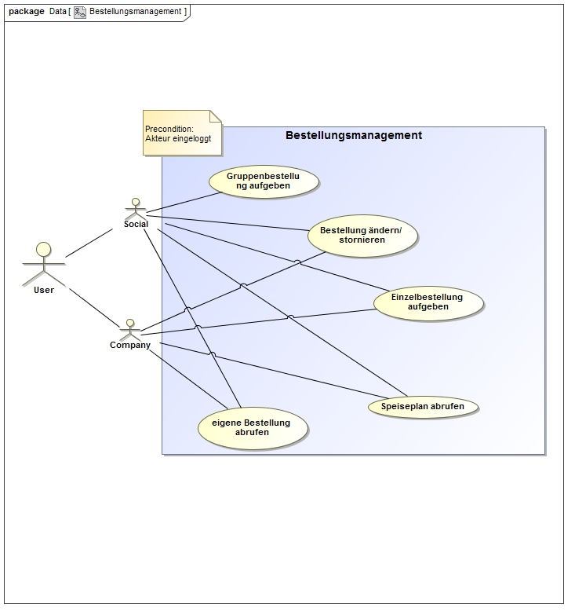
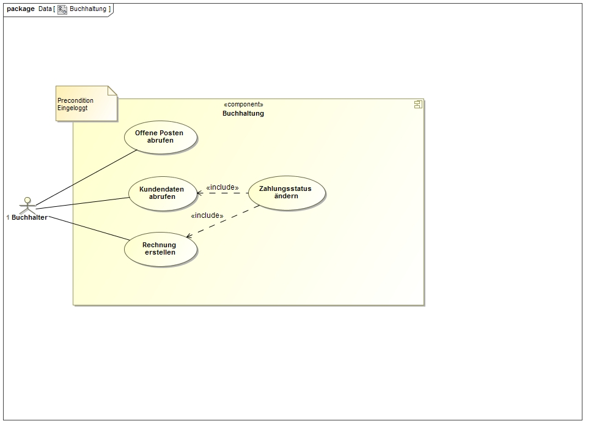
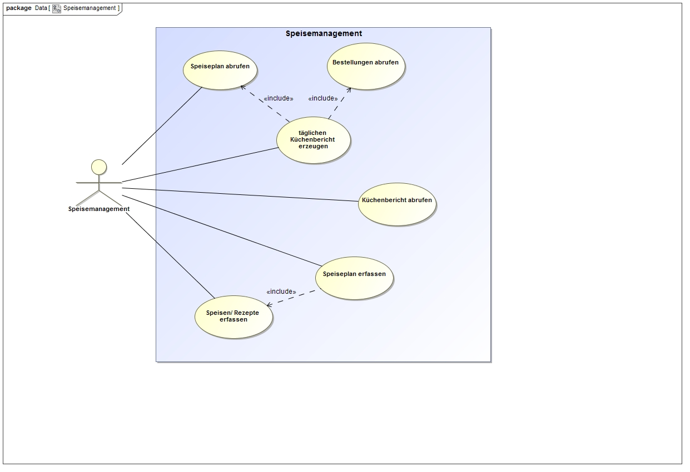
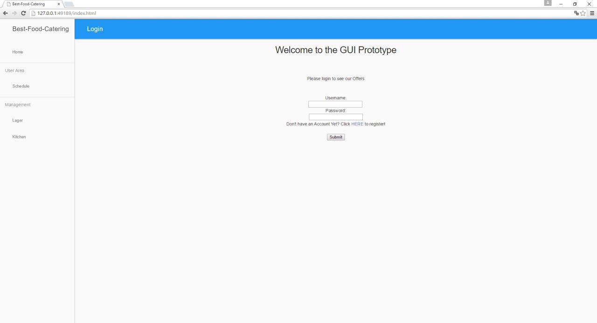
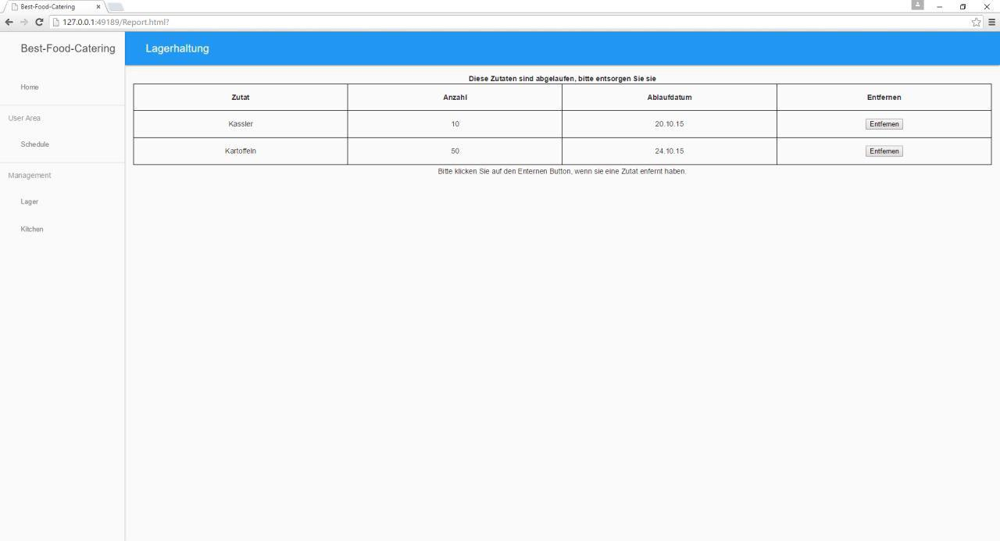
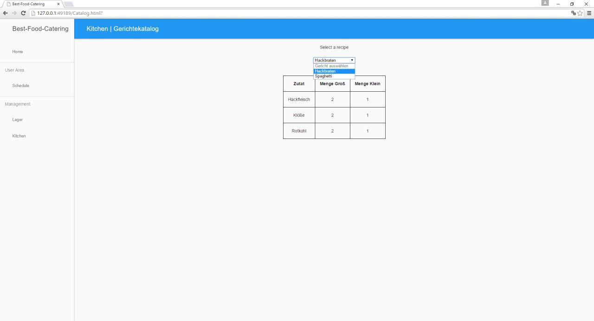
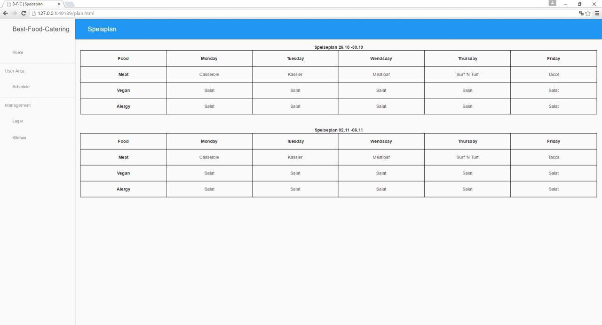
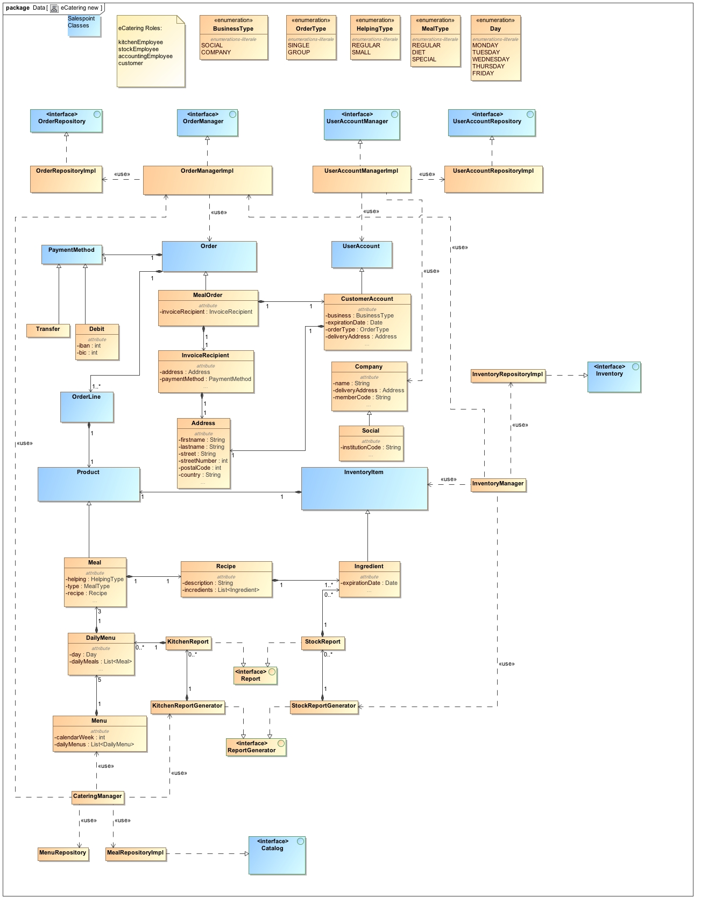

= Pflichtenheft

== BEST-FOOD-Catering GmbH & Co. KG

__Version:__    *1.0*

__Status:__     *In Arbeit*

__Stand:__      *18.11.2015*

== Zusammenfassung
Im Folgenden wird die Entwicklung einer Software-Technischen Loesung fuer die Betriebsorganisation der "Best-Food-Catering GmbH & Co. KG" beschrieben.

== Inhaltsverzeichnis
. Aufgabenstellung und Zielsetzung
. Fachlicher Ueblick
. Systemgrenze und Top-Level-Architektur
.. Kontextdiagramme
.. Top-level architecture	
. Anwendungsfaelle
.. Ueberblick Anwendungsfalldiagramm
.. Akteure
.. Anwendungsfallbeschreibungen	 
. Anforderungen
.. Muss-Kriterien 
.. Kann-Kriterien
. GUI Prototyp
.. Ueberblick: Dialoglandkarte
.. Dialogbeschreibung
. Datenmodell
.. Klassendiagramm
.. Klassen und Enumerationen
. Akzeptanztestfaelle
. Offene Punkte

== Aufgabenstellung und Zielsetzung
Die Best-Food-Catering GmbH & Co. KG ist ein aufstrebender Betrieb der sich auf die besonderen Anforderungen der Essensbelieferung von Kindertagesstaetten und Gross-Unternehmen spezialisiert hat.
Aufgrund des gestiegenen Interesses an Kinderbetreuung in den alten Bundeslaendern ist die Betriebsorganisation fuer ein deutliches Wachstum auszugestalten und dies beinhaltet eine Software-Technische Loesung.
Innerbetrieblich sind die drei Bereiche Kueche, Debitorenbuchhaltung und Lagerhaltung zu nennen und als Schnittstelle zu den Kunden das Online-Bestellsystem.
Fuer die Kueche ist ein taeglicher Bericht notwendig. Der Bericht muss alle zu kochenden Essen enthalten mit Anzahl und Rezepten. Dabei koennen je Essen jeweils unterschiedliche Portionierungen auftreten, da Kita-Kinder eine kleinere Portion bekommen als Mitarbeiter eines Gross-Unternehmens.
In der Debitorenbuchhaltung werden alle Kundendatensaetze verwaltet und deren Zahlungsforderungen bearbeitet. Kindertagesstaetten koennen dabei zwischen zwei Abrechnungsmodellen waehlen; der Einzel- und der Gruppenabrechnung. In der Gruppenabrechnung werden alle an die Kindertagesstaette gelieferten Essen als Ganzes in Rechnung gestellt und die ErzieherInnen sammeln bei den Eltern das Geld selber ein. Aufgrund des geringeren Verwaltungsaufwandes wird diesen Tagesstaetten dann einen Rabatt von 7% auf den Netto Rechnungspreis gewaehrt. Gross-Unternehmen koennen nur eine Einzelabrechnung machen. In der Einzelabrechnung wird direkt mit den Eltern der Kinder bzw. den Mitarbeitern der Gross-Unternehmen abgerechnet. Eine entsprechende Rechnung wird im Online-System angezeigt.
Unabhaengig von den Abrechnungsmodellen kann jeder Debitor zwischen Lastschrift und Ueberweisung waehlen. Die Abwicklung und Kontrolle des Geldtransfers liegen in alleiniger Verantwortung der Best-Food-Catering GmbH & Co. KG und nicht im Aufgabenfeld des hier beschriebenen Software-Systems.
In der Lagerhaltung muessen alle Zutaten fuer die Herstellung verwaltet werden. Dabei ist fuer verderbliche Produkte das Mindesthaltbarkeitsdatum zu beachten und grundsaetzlich nach dem FIFO Prinzip vorzugehen. Woechentlich wird ein Bericht benoetigt der alle Nachbestellungen auflistet; auf Basis des Speiseplans. Sollten im Lager Waren sein, deren Haltbarkeit abgelaufen ist, muessen diese automatisch aus dem System entfernt werden und der Lagerist muss informiert werden.
Zur Sicherung einer ausgewogenen Ernaehrung wird der Speiseplan immer mindestens zwei Wochen im Voraus veroeffentlicht. Die Veroeffentlichung erfolgt online im System, nicht via Newsletter o.ae. Die Eltern oder Mitarbeiter koennen dann im Online-System das Essen bestellen. Frist fuer die Essensbestellung durch den Kunden ist eine Woche im Voraus. Eine nachtraegliche Aenderung einer abgeschlossenen Bestellung ist nicht vorgesehen.
Zur Vereinfachung der Kuechen-Logistik existieren immer drei Menue-Linien. Die erste Menue-Linie sind die Normal-Esser. Fuer Menschen mit Unvertraeglichkeiten gibt es als zweite Menue-Linie die Diaetkostler und als drittes die Sonder-Esser. Damit Eltern oder Mitarbeiter den Bestellvorgang online durchfuehren koennen, benoetigen diese einen Benutzerzugang der zeitlich - mit Ende der Betreuung des Kindes, oder Ablauf des Arbeitsvertrages - ablaeuft. Die Freischaltung der Nutzer erfolgt automatisch.  Grundsaetzlich werden fuer Kindertagesstaetten und Gross- Unternehmen zwei getrennte Speiseplaene veroeffentlicht um den Aufwand fuer die Portionierung zu senken.

== Fachlicher Ueberblick
Die zu erstellende Web-Anwendung soll eine Plattform fuer den Service und Vertrieb der Best-Food-Catering GmbH & Co. KG bieten. Das Application Framework "Salespoint" wird hierbei zusammen mit dem Spring Framework zur Java-basierten Entwicklung der Point-of-Sales-Applikation verwendet. Es besteht aus einer Vielzahl von Geschaeftsmodulen, die es moeglich machen, die verschiedenen anspruchsvollen Teile der Web-Anwendung umzusetzen.

== Systemgrenze und Top-Level-Architektur

=== Kontextdiagramm
*EINZUFUEGEN:* Kontextdiagramm
//Das Kontextdiagramm zeigt das geplante Software-System in seiner Umgebung. Zur Umgebung gehoeren alle Nutzergruppen des Systems und Nachbarsysteme. Die Grafik kann auch informell gehalten sein. Ueberlegen Sie sich dann geeignete Symbole. Die Grafik kann beispielsweise mit Visio erstellt werden. Wenn noetig, erlaeutern Sie diese Grafik.

=== Top-level architecture

image::Komponentendiagramm_new.jpg[caption="Top-Level Architektur"]

== Anwendungsfaelle

=== Ueberblick Anwendungsfalldiagramme

image::Lagermanagement_new.jpg[caption="Lagermanagement: ",title="Das Use-Case Lagermanagement zeigt die Arbeit die Lagerverwalter und E-Catering System tätigen. Der Lagerverwalter erfasst Lebensmittel und ruft den Nachbestellungsbericht ab, welcher eine automatische Haltbarkeitskontrolle beinhaltet. Das E-Catering System erzeugt einen wöchentlichen Nachbestellungsbericht, welcher die automatische Haltbarkeitskontrolle, sowie das Abrufen des Lagerbestands beinhaltet und das Speisenmanagement zum erzeugen nutzt."]
image::Nutzermanagement_new.jpg[caption="Nutzermanagement: ", title="Das Use-Case Nutzermanagement zeigt die verschiedenen Möglichkeiten beim registrieren,speichern und verwalten von Nutzerdaten anhand des E-Catering Systems und dem Nutzer. Der Nutzer kann sich registrieren, die eigenen Profildaten ändern und eine Passwortänderung beantragen. Je nach Aktion des Nutzers: registriert bzw. aktiviert das E-Catering System den Nutzer, schickt Passwortsänderungsmeldungen, schickt Registrierungs- bzw. Aktivierungsbestätigungen oder deaktiviert den Nutzer."]

=== Akteure

Im Folgenden werden die Benutzer des Software-Systems beschrieben:

[options="header"]
|===
|Name             |Beschreibung
|Lagerist         |Verwaltung aller Zutaten fuer die Herstellung unter besonderer Beachtung von Mindesthaltbarkeit und moeglicher Nachbestellung
|Kuechenmitarbeiter|Nutzung des taeglichen Berichts zum Kochen der Gerichte unter Beruecksichtigung von Anzahl und Rezept
|Buchhalter       |Verwaltung aller Kundendatensaetze und deren Zahlungsforderungen
|Kunde            |Registrierung als Zugehoeriger einer (unternehmerischen oder sozialen) Einrichtung und Bestellung (normaler oder kleiner) Gerichte
|Gruppenbesteller |Gruppenabrechnung ueber Verantwortlichen einer sozialen Einrichtung unter Beruecksichtigung von Rabatt
|===

=== Anwendungsfallbeschreibungen
image::SequenzDiagramm/Sequence_Diagram__Data__CustomerOrder.jpg[caption="Sequenzdiagramm Customer Order: ", title="logs in and checks expiration date. Gets one of the menu types, from which the customer can choose. He adds wished amount and the total price is calculated. Through getPaymenMethod the customer chooses payment option, then he makes the transaction of choice. Finally, we get the address and through completeOrder() the bill is sent to the customer. "]
image::SequenzDiagramm/Sequence_Diagram__Data__createMenu.jpg[caption="Sequenzdiagramm Create Menu: ", title="KitchenManager logs in and we request all Meals from the database. He then creates three different menus, that each contain 5 days and 5 meals. He then saves each meal, before saving the whole menu"]
image::SequenzDiagramm/Sequence_Diagram__InventoryManager__InventoryManager.jpg[caption="Sequenzdiagramm Inventory Manager:", title="Checks expiration"]
image::SequenzDiagramm/Sequence_Diagram__createMeal__createMeal.jpg[caption="Sequenzdiagramm Create Meal: ", title="KitchenReport checks date before KitchenManager requests recipes. KitchenReport then gets Quantity and Ingredients. The information is returned to KitchenManager and the Meal is created. Finally a report is generated."]
image::SequenzDiagramm/Sequence_Diagram__restock__restock.jpg[caption="Sequenzdiagramm Restock: ", title="If the order is bigger than the current Inventory, a report is generated."]
image::SequenzDiagramm/Sequence_Diagram__BusinessManager__BusinessManager.jpg[caption="Sequenzdiagramm BusinessManager: ", title="If the Business is a company we create a new CompanyBusiness, otherwise we make a ChildcareBusiness. A Deliveryaddress is added and a confirmation is sent to BusinessManager."]

//Dieser Unterabschnitt beschreibt die Anwendungsfaelle. In dieser Beschreibung muessen noch nicht alle Sonderfaelle und Varianten beruecksichtigt werden. Schwerpunkt ist es, die wichtigsten Anwendungsfaelle des Systems zu finden. Wichtig sind solche Anwendungsfaelle, die fuer den Auftraggeber, den Nutzer den groessten Nutzen bringen.
//Fuer komplexere Anwendungsfaelle ein UML-Sequenzdiagramm ergaenzen.
//Einfache Anwendungsfaelle mit einem Absatz beschreiben.
//Die typischen Anwendungsfaelle (Anlegen, Aendern, Loeschen) koennen zu einem einzigen zusammengefasst werden.

== Anforderungen

=== Muss-Kriterien
* Innerbetrieblich

** Lagerhaltung
*** Verwaltung des Lagerbestandes
*** Ausgabe eines woechentlichen Berichts zu Nachbestellungen
*** Kontrolle von Zutaten mit ueberschrittener Mindesthaltbarkeit
*** Login

** Kueche
*** Ausgabe eines taeglichen Berichts:
**** Gertichte nach Menulinien
**** Anzahl
**** Rezepte
*** Login

** Debitorenbuchhaltung
*** Verwaltung aller Kundendatensaetze
*** Bearbeitung des Zahlungsstatus
*** Hinzufuegen neuer Unternehmen
*** Login

* Kundenschnittstelle

** Account
*** Registrierung
*** Login
*** Verwaltung persoenlicher Daten (ohne Rechnungsinformationen)

** Verkauf
*** Produktuebersicht (Speiseplan)
*** Bestellvorgang
*** Bezahlungsvorgang

=== Kann-Kriterien
* Automatische Erstellung des Speiseplans unter besonderer Beachtung von Mindesthaltbarkeit und Lagerbestand

== GUI Prototyp

=== Ueberblick: Dialoglandkarte mit Beschreibungen

image::gui_inventory_date.jpg[caption="Dialog 3: ", title="Verfallsdatumseingabe", alt="Date"]

//Fuer jeden Dialog:

//1. Kurze textuelle Dialogbeschreibung eingefuegt: Was soll der jeweilige Dialog? Was kann man damit tun? Ueberblick?
//2. Maskenentwuerfe (Screenshot, Mockup)
//3. Maskenelemente (Ein/Ausgabefelder, Aktionen wie Buttons, Listen, ...)
//4. Evtl. Maskendetails, spezielle Widgets

== Datenmodell

=== Ueberblick: Klassendiagramm

*Beschreibung Analyseklassendiagramm eCatering*

Im Online-Cateringsystem „eCatering“ gibt es generell zwei Arten von Nutzern(UserAccount) welche mit dem System arbeiten. Es wird unterschieden zwischen eCatering-Angestellten(Employee) und den Kunden(Customer). Da ein Angestellter(Employee) keine weiteren Spezialitaeten aufweist, als die von Salespoint aus der Klasse UserAccount gegebenen, wird diesem ein UserAccount mit jeweils einer Zustaendigkeit(Role) zugeordnet. Ein Angestellter(Employee) kann die Rollen(Role) Kuechenmitarbeiter(kitchenEmployee), Lagerist(stockEmployee) oder Buchhalter(accountingEmployee) haben. Da es keinen Administrator fuer unser System gibt, werden vor Systemstart alle Angestellten(UserAccount) in die Datenbank hinzugefuegt und bekommen einen Loginnamen und Passwort. Der Kunde(Customer) braucht einen separaten Account(CustomerAccount) und hat die Rolle „Kunde“(Role:Customer), da dieser weitere Daten speichern muss, wie das Ablaufdatum seines Zugangs(expirationDate), welches er selbst festlegen kann, sowie Geschaeftsart(business), Bestelltyp(orderType) und Lieferadresse(deliveryAddress), welche bei Registrierung feststeht.
Diese Daten bekommt er von seiner Firma(Company) bzw. sozialen Einrichtung(Social), welche in der Datenbank gespeichert ist. Jede Firma(Company) besitzt einen speziellen Code(memberCode), welchen alle Mitarbeiter dieser Firma bei der Registration eingeben muessen. Soziale Einrichtungen (Social) besitzen zusaetzlich noch einen Hauptcode(institutionCode), welchen nur die Leiter der Einrichtungen kennen. Diese koennen dann nach Registration im System nur Gruppenbestellungen
ausfuehren(OrderType:GROUP). Eine Essensbestellung(MealOrder) besitzt genau einen Rechnungsempfaenger(InvoiceRecipient) mit Zahlmethode(PaymentMethod) als Spezialitaet, sowie genau einen Kunden(CustomerAccount) dazu. Eine Essensbestellung(MealOrder) beinhaltet zudem eine Liste(OrderLine) an Mahlzeiten(Meal) aus dem Speiseplan(Menu) der naechsten 2 Wochen.
Eine Mahlzeit(Meal) ist ein Produkt(Product) und hat zusaetzlich eine Portionsgroesse(HelpingType), eine Gerichtslinie(MealType) und ein Rezept(Recipe), aus dem sie besteht. Das Rezept(Recipe) listet alle Zutaten(Ingredient) auf und besitzt eine Kochanleitung(description). Eine Zutat(Ingredient) ist ein Lagergut(InventoryItem) mit einer zusaetzlichen Haltbarkeitsangabe(expirationDate). Um den korrekten Ablauf des Systems sicherzustellen, benoetigt es einige Manager. Zu den Managern aus Salespoint, existieren der Speisenmanager(CateringManager), welcher einzelne Speisen(Meal) und Speiseplaene(Menu) verwalten kann, und anhand der Bestellungen(Order) einen taeglichen Bericht(KitchenReport) an die Kueche liefert. Der Lagermanager(InventoryManager) informiert den Lageristen(stockEmployee) wenn abgelaufene Gueter(Ingredient) im Lager existieren und startet einen Nachbestellbericht(StockReport), sobald die Lagergueter nicht ausreichen um die aktuellen Bestellungen (Order) zu decken. Je nach Vorgehensweise koennte es noch einen Firmenmanager(CompanyManager) geben, welcher weitere Firmen in der Datenbank speichert.

=== Klassen und Enumerationen

//Dieser Abschnitt stellt eine Vereinigung von Glossar und der Beschreibung von Klassen/Enumerationen dar. Jede Klasse und Enumeration wird in Form eines Glossars textuell beschrieben. Zusaetzlich werden eventuellen Konsistenz- und Formatierungsregeln aufgefuehrt.

// See http://asciidoctor.org/docs/user-manual/#tables
[options="header"]
|===
|Klasse/Enumeration               |Beschreibung
|OrderRepositoryImpl |OrderRepository implementiert
|OrderManagerImpl |OrderManager implementiert
|UserAccountManagerImpl|UserAccountManager implementiert
|UserAccountRepositoryImpl |UserAccountRepository implementiert
|MealOrder | Verwaltet Bestellung
|Transfer | Überweisung
|Debit | SEPA-Lastschrift Verfahren
|InvoiceRecipient | Besteller
|Address | Adressdaten
|Customer Account| Erbt von UserAccount
|Company | Unternehmen
|BusinessManager | Debitorenbuchhaltung
|BusinessRepository | Repository für BusinessManager
|Childcare | Soziale Einrichtung
|Inventory Manager | Lagerverwaltung
|InventoryRepository | Inventory implementiert
|Meal | Mahlzeit
|Recipe | Rezept
|Ingredient | Zutat
|DailyMenu | Speiseplan für den Tag
|KitchenReport | Bericht an Küche
|StockReport | Bericht an Lagerverwaltung
|KichenReportGenerator | ReportGenerator implementiert
|StockReportGenerator | ReportGenerator implementiert
|Menu | Speiseplan
|KitchenManager | Erstellt Speiseplan
|MenuRepository | Repository für Speiseplan
|MealRepository | Repository für Gerichte
|RecipeRepository | Repository für Rezepte
|===

== Aktzeptanztestfaelle
*OFFEN:* jUnitTests in Arbeit
//Mithilfe von Akzeptanztests wird geprueft, ob die Software die funktionalen Erwartungen und Anforderungen im Gebrauch erfuellt. Diese sollen und koennen aus den Anwendungsfallbeschreibungen und den UML-Sequenzdiagrammen abgeleitet werden. D.h., pro (komplexen) Anwendungsfall gibt es typischerweise mindestens ein Sequenzdiagramm (welches ein Szenarium beschreibt). Fuer jedes Szenarium sollte es einen Akzeptanztestfall geben. Listen Sie alle Akzeptanztestfaelle in tabellarischer Form auf. Jeder Testfall soll mit einer ID versehen werde, um spaeter zwischen den Dokumenten (z.B. im Test-Plan) referenzieren zu koennen.

== Offene Punkte
* Kontextdiagramm
* Akzeptanztestfaelle: jUnitTests in Arbeit...