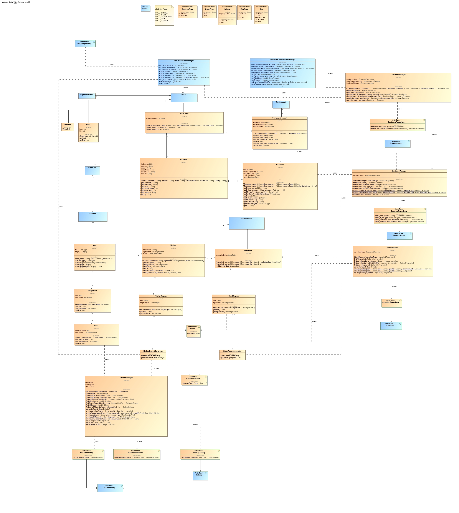

= Pflichtenheft

== BEST-FOOD-Catering GmbH & Co. KG

__Version:__    *1.1*

__Status:__     *In Arbeit*

__Stand:__      *24.11.2015*

== Zusammenfassung
Im Folgenden wird die Entwicklung einer Software-Technischen Lösung für die Betriebsorganisation der "Best-Food-Catering GmbH & Co. KG" im Rahmen des Softwaretechnologie-Praktikum and der Technischen Universität Dresden beschrieben.

== Inhaltsverzeichnis
. Aufgabenstellung und Zielsetzung
. Fachlicher Üblick
. Top-Level-Architektur	
. Anwendungsfälle
.. Überblick Anwendungsfalldiagramm
.. Akteure
.. Anwendungsfallbeschreibungen	 
. Anforderungen
.. Muss-Kriterien 
.. Kann-Kriterien
. GUI Prototyp
.. Überblick: Dialoglandkarte
.. Dialogbeschreibung
. Datenmodell
.. Klassendiagramm
.. Klassen und Enumerationen
. Akzeptanztestfälle
. Offene Punkte

== Aufgabenstellung und Zielsetzung
Die Best-Food-Catering GmbH & Co. KG ist ein aufstrebender Betrieb der sich auf die besonderen Anforderungen der Essensbelieferung von Kindertagesstaetten und Gross-Unternehmen spezialisiert hat.
Aufgrund des gestiegenen Interesses an Kinderbetreuung in den alten Bundeslaendern ist die Betriebsorganisation für ein deutliches Wachstum auszugestalten und dies beinhaltet eine Software-Technische Lösung.
Innerbetrieblich sind die drei Bereiche Küche, Debitorenbuchhaltung und Lagerhaltung zu nennen und als Schnittstelle zu den Kunden das Online-Bestellsystem.
Für die Küche ist ein täglicher Bericht notwendig. Der Bericht muss alle zu kochenden Essen enthalten mit Anzahl und Rezepten. Dabei können je Essen jeweils unterschiedliche Portionierungen auftreten, da Kita-Kinder eine kleinere Portion bekommen als Mitarbeiter eines Gross-Unternehmens.
In der Debitorenbuchhaltung werden alle Kundendatensätze verwaltet und deren Zahlungsforderungen bearbeitet. Kindertagesstätten können dabei zwischen zwei Abrechnungsmodellen wählen; der Einzel- und der Gruppenabrechnung. In der Gruppenabrechnung werden alle an die Kindertagesstätte gelieferten Essen als Ganzes in Rechnung gestellt und die ErzieherInnen sammeln bei den Eltern das Geld selber ein. Aufgrund des geringeren Verwaltungsaufwandes wird diesen Tagesstätten dann einen Rabatt von 7% auf den Netto Rechnungspreis gewährt. Gross-Unternehmen können nur eine Einzelabrechnung machen. In der Einzelabrechnung wird direkt mit den Eltern der Kinder bzw. den Mitarbeitern der Gross-Unternehmen abgerechnet. Eine entsprechende Rechnung wird im Online-System angezeigt.
Unabhängig von den Abrechnungsmodellen kann jeder Debitor zwischen Lastschrift und Überweisung wählen. Die Abwicklung und Kontrolle des Geldtransfers liegen in alleiniger Verantwortung der Best-Food-Catering GmbH & Co. KG und nicht im Aufgabenfeld des hier beschriebenen Software-Systems.
In der Lagerhaltung müssen alle Zutaten für die Herstellung verwaltet werden. Dabei ist für verderbliche Produkte das Mindesthaltbarkeitsdatum zu beachten und grundsätzlich nach dem FIFO Prinzip vorzugehen. Wöchentlich wird ein Bericht benötigt der alle Nachbestellungen auflistet; auf Basis des Speiseplans. Sollten im Lager Waren sein, deren Haltbarkeit abgelaufen ist, müssen diese automatisch aus dem System entfernt werden und der Lagerist muss informiert werden.
Zur Sicherung einer ausgewogenen Ernährung wird der Speiseplan immer mindestens zwei Wochen im Voraus veröffentlicht. Die Veröffentlichung erfolgt online im System, nicht via Newsletter o.ä. Die Eltern oder Mitarbeiter können dann im Online-System das Essen bestellen. Frist für die Essensbestellung durch den Kunden ist eine Woche im Voraus. Eine nachträgliche Änderung einer abgeschlossenen Bestellung ist nicht vorgesehen.
Zur Vereinfachung der Küchen-Logistik existieren immer drei Menu-Linien. Die erste Menu-Linie sind die Normal-Esser. Für Menschen mit Unverträglichkeiten gibt es als zweite Menu-Linie die Diätkostler und als drittes die Sonder-Esser. Damit Eltern oder Mitarbeiter den Bestellvorgang online durchführen können, benötigen diese einen Benutzerzugang der zeitlich - mit Ende der Betreuung des Kindes, oder Ablauf des Arbeitsvertrages - abläuft. Die Freischaltung der Nutzer erfolgt automatisch.  Grundsätzlich werden für Kindertagesstätten und Gross- Unternehmen zwei getrennte Speisepläne veröffentlicht um den Aufwand für die Portionierung zu senken.

== Fachlicher Überblick
Die zu erstellende Web-Anwendung soll eine Plattform für den Service und Vertrieb der Best-Food-Catering GmbH & Co. KG bieten. Das Application Framework "Salespoint" wird hierbei zusammen mit dem Spring Framework zur Java-basierten Entwicklung der Point-of-Sales-Applikation verwendet. Es besteht aus einer Vielzahl von Geschäftsmodulen, die es möglich machen, die verschiedenen anspruchsvollen Teile der Web-Anwendung umzusetzen.

== Top-Level-Architektur

== Anwendungsfälle

=== Überblick Anwendungsfalldiagramme

image:UseCaseDiagramm/Bestellungsmanagement_new.jpg[caption="Bestellmanagement", title="Das Use-Case Bestellungsmanagement zeigt die verschiedenen Möglichkeiten die ein User des E-catering hat rund ums Bestellen einer Mahlzeit. Der User Company kann eine Einzelbestellung aufgeben, den Speiseplan abrufen, die Bestellung ändern/stornieren und die eigene Bestellung abrufen. Der User Social besitzt neben den selben Möglichkeiten auch die Option eine Gruppenbestellung aufzugeben."]

image::UseCaseDiagramm/Speisemanagement_new.jpg[caption="Speisemanagement: ",title="Das Use-Case Speisemanagment zeigt die Arbeitsmöglichkeiten des Küchenpersonals im System. Er kann den Speiseplan, sowie den Küchenbericht abrufen, den täglichen Küchenbericht erzeugen(dies beinhaltet die Möglichkeit Bestellungen abrufen zu können) und Speisen\Rezepte, sowie den Speiseplan erfassen."]

image::UseCaseDiagramm/Nutzermanagement_new.jpg[caption="Nutzermanagement: ", title="Das Use-Case Nutzermanagement zeigt die verschiedenen Möglichkeiten beim registrieren,speichern und verwalten von Nutzerdaten anhand des E-Catering Systems und dem Nutzer. Der Nutzer kann sich registrieren, die eigenen Profildaten ändern und eine Passwortänderung beantragen. Je nach Aktion des Nutzers: registriert bzw. aktiviert das E-Catering System den Nutzer, schickt Passwortsänderungsmeldungen, schickt Registrierungs- bzw. Aktivierungsbestätigungen oder deaktiviert den Nutzer."]

=== Akteure

Im Folgenden werden die Benutzer des Software-Systems beschrieben:

[options="header"]
|===
|Name             |Beschreibung
|Lagerist         |Verwaltung aller Zutaten für die Herstellung unter besonderer Beachtung von Mindesthaltbarkeit und möglicher Nachbestellung
|Küchenmitarbeiter|Nutzung des täglichen Berichts zum Kochen der Gerichte unter Berücksichtigung von Anzahl und Rezept
|Buchhalter       |Verwaltung aller Kundendatensätze und deren Zahlungsforderungen
|Kunde            |Registrierung als Zugehöriger einer (unternehmerischen oder sozialen) Einrichtung und Bestellung (normaler oder kleiner) Gerichte
|Gruppenbesteller |Gruppenabrechnung über Verantwortlichen einer sozialen Einrichtung unter Berücksichtigung von Rabatt
|===

=== Anwendungsfallbeschreibungen

image::SequenzDiagramm/Sequence_Diagram__Data__createMenu.jpg[caption="Sequenzdiagramm Create Menu: ", title="KitchenManager logs in and we request all Meals from the database. He then creates three different menus, that each contain 5 days and 5 meals. He then saves each meal, before saving the whole menu"]

image::SequenzDiagramm/Sequence_Diagram__restock__restock.jpg[caption="Sequenzdiagramm Restock: ", title="If the order is bigger than the current Inventory, a report is generated."]
image::SequenzDiagramm/Sequence_Diagram__BusinessManager__BusinessManager.jpg[caption="Sequenzdiagramm BusinessManager: ", title="If the Business is a company we create a new CompanyBusiness, otherwise we make a ChildcareBusiness. A Deliveryaddress is added and a confirmation is sent to BusinessManager."]

//Dieser Unterabschnitt beschreibt die Anwendungsfälle. In dieser Beschreibung müssen noch nicht alle Sonderfälle und Varianten berücksichtigt werden. Schwerpunkt ist es, die wichtigsten Anwendungsfälle des Systems zu finden. Wichtig sind solche Anwendungsfälle, die für den Auftraggeber, den Nutzer den grössten Nutzen bringen.
//Für komplexere Anwendungsfälle ein UML-Sequenzdiagramm ergänzen.
//Einfache Anwendungsfälle mit einem Absatz beschreiben.
//Die typischen Anwendungsfälle (Anlegen, Ändern, Löschen) können zu einem einzigen zusammengefasst werden.

== Anforderungen

=== Muss-Kriterien
. Innerbetrieblich

.. Lagerhaltung
... Verwaltung des Lagerbestandes
... Ausgabe eines wöchentlichen Berichts zu Nachbestellungen
... Kontrolle von Zutaten mit überschrittener Mindesthaltbarkeit
... Login

.. Küche
... Rezepte anlegen
... Mahlzeiten anlegen
... Erstellen von Speiseplan
... Ausgabe eines täglichen Berichts:
.... Gerichte nach Menulinien
.... Anzahl
.... Rezepte
... Login

.. Debitorenbuchhaltung
... Verwaltung aller Kundendatensätze
... Bearbeitung des Zahlungsstatus
... Hinzufügen neuer Unternehmen
... Login

. Kundenschnittstelle

.. Account
... Registrierung
... Login
... Verwaltung persönlicher Daten (ohne Rechnungsinformationen)

.. Verkauf
... Produktübersicht (Speiseplan)
... Bestellvorgang
... Bezahlungsvorgang

=== Kann-Kriterien
* Automatische Erstellung des Speiseplans unter besonderer Beachtung von Mindesthaltbarkeit und Lagerbestand

== GUI Prototyp

=== Überblick: Dialoglandkarte mit Beschreibungen

image::GuiPrototype/gui_login.jpg[caption="Dialog 1: ", title="Loginscreen", alt="Login"]

image::GuiPrototype/gui_inventory_date.jpg[caption="Dialog 3: ", title="Verfallsdatumseingabe", alt="Date"]

image::GuiPrototype/gui_menu.jpg[caption="Dialog 5: ", title="Überblick Speiseplan", alt="Menu"]

//Für jeden Dialog:

//1. Kurze textülle Dialogbeschreibung eingefügt: Was soll der jeweilige Dialog? Was kann man damit tun? Überblick?
//2. Maskenentwürfe (Screenshot, Mockup)
//3. Maskenelemente (Ein/Ausgabefelder, Aktionen wie Buttons, Listen, ...)
//4. Evtl. Maskendetails, spezielle Widgets

== Datenmodell

=== Überblick: Klassendiagramm

*Beschreibung Analyseklassendiagramm eCatering*

Im Online-Cateringsystem „eCatering“ gibt es generell zwei Arten von Nutzern(UserAccount) welche mit dem System arbeiten. Es wird unterschieden zwischen eCatering-Angestellten(Employee) und den Kunden(Customer). Da ein Angestellter(Employee) keine weiteren Spezialitäten aufweist, als die von Salespoint aus der Klasse UserAccount gegebenen, wird diesem ein UserAccount mit jeweils einer Zuständigkeit(Role) zugeordnet. Ein Angestellter(Employee) kann die Rollen(Role) Küchenmitarbeiter(kitchenEmployee), Lagerist(stockEmployee) oder Buchhalter(accountingEmployee) haben. Da es keinen Administrator für unser System gibt, werden vor Systemstart alle Angestellten(UserAccount) in die Datenbank hinzugefügt und bekommen einen Loginnamen und Passwort. Der Kunde(Customer) braucht einen separaten Account(CustomerAccount) und hat die Rolle „Kunde“(Role:Customer), da dieser weitere Daten speichern muss, wie das Ablaufdatum seines Zugangs(expirationDate), welches er selbst festlegen kann, sowie Geschäftsart(business), Bestelltyp(orderType) und Lieferadresse(deliveryAddress), welche bei Registrierung feststeht.
Diese Daten bekommt er von seiner Firma(Company) bzw. sozialen Einrichtung(Social), welche in der Datenbank gespeichert ist. Jede Firma(Company) besitzt einen speziellen Code(memberCode), welchen alle Mitarbeiter dieser Firma bei der Registration eingeben müssen. Soziale Einrichtungen (Social) besitzen zusätzlich noch einen Hauptcode(institutionCode), welchen nur die Leiter der Einrichtungen kennen. Diese können dann nach Registration im System nur Gruppenbestellungen
ausführen(OrderType:GROUP). Eine Essensbestellung(MealOrder) besitzt genau einen Rechnungsempfänger(InvoiceRecipient) mit Zahlmethode(PaymentMethod) als Spezialität, sowie genau einen Kunden(CustomerAccount) dazu. Eine Essensbestellung(MealOrder) beinhaltet zudem eine Liste(OrderLine) an Mahlzeiten(Meal) aus dem Speiseplan(Menu) der nächsten 2 Wochen.
Eine Mahlzeit(Meal) ist ein Produkt(Product) und hat zusätzlich eine Portionsgrösse(HelpingType), eine Gerichtslinie(MealType) und ein Rezept(Recipe), aus dem sie besteht. Das Rezept(Recipe) listet alle Zutaten(Ingredient) auf und besitzt eine Kochanleitung(description). Eine Zutat(Ingredient) ist ein Lagergut(InventoryItem) mit einer zusätzlichen Haltbarkeitsangabe(expirationDate). Um den korrekten Ablauf des Systems sicherzustellen, benötigt es einige Manager. Zu den Managern aus Salespoint, existieren der Speisenmanager(CateringManager), welcher einzelne Speisen(Meal) und Speisepläne(Menu) verwalten kann, und anhand der Bestellungen(Order) einen täglichen Bericht(KitchenReport) an die Küche liefert. Der Lagermanager(InventoryManager) informiert den Lageristen(stockEmployee) wenn abgelaufene Güter(Ingredient) im Lager existieren und startet einen Nachbestellbericht(StockReport), sobald die Lagergüter nicht ausreichen um die aktuellen Bestellungen (Order) zu decken. Je nach Vorgehensweise könnte es noch einen Firmenmanager(CompanyManager) geben, welcher weitere Firmen in der Datenbank speichert.

=== Klassen und Enumerationen

//Dieser Abschnitt stellt eine Vereinigung von Glossar und der Beschreibung von Klassen/Enumerationen dar. Jede Klasse und Enumeration wird in Form eines Glossars textuell beschrieben. Zusätzlich werden eventuellen Konsistenz- und Formatierungsregeln aufgeführt.

// See http://asciidoctor.org/docs/user-manual/#tables
[options="header"]
|===
|Klasse/Enumeration               |Beschreibung
|OrderRepositoryImpl |OrderRepository implementiert
|OrderManagerImpl |OrderManager implementiert
|UserAccountManagerImpl|UserAccountManager implementiert
|UserAccountRepositoryImpl |UserAccountRepository implementiert
|MealOrder | Verwaltet Bestellung
|Transfer | Überweisung
|Debit | SEPA-Lastschrift Verfahren
|InvoiceRecipient | Besteller
|Address | Adressdaten
|Customer Account| Erbt von UserAccount
|Company | Unternehmen
|BusinessManager | Debitorenbuchhaltung
|BusinessRepository | Repository für BusinessManager
|Childcare | Soziale Einrichtung
|Inventory Manager | Lagerverwaltung
|InventoryRepository | Inventory implementiert
|Meal | Mahlzeit
|Recipe | Rezept
|Ingredient | Zutat
|DailyMenu | Speiseplan für den Tag
|KitchenReport | Bericht an Küche
|StockReport | Bericht an Lagerverwaltung
|KichenReportGenerator | ReportGenerator implementiert
|StockReportGenerator | ReportGenerator implementiert
|Menu | Speiseplan
|KitchenManager | Erstellt Speiseplan
|MenuRepository | Repository für Speiseplan
|MealRepository | Repository für Gerichte
|RecipeRepository | Repository für Rezepte
|BusinessType| Enumeration, die zwischen sozialer und unternehmerischer Einrichtung unterscheidet
|OrderType|Enumeration, die zwischen Einzel- und Gruppenbestellung unterscheidet
|Helping|Enumeration, die die Portionsgröße spezifiziert
|MealType|Enumeration, die die Menu-Linie angibt
|Day|Enumeration für Wochentage
|===

== Aktzeptanztestfälle
*OFFEN:* jUnitTests in Arbeit
//Mithilfe von Akzeptanztests wird geprüft, ob die Software die funktionalen Erwartungen und Anforderungen im Gebrauch erfüllt. Diese sollen und können aus den Anwendungsfallbeschreibungen und den UML-Sequenzdiagrammen abgeleitet werden. D.h., pro (komplexen) Anwendungsfall gibt es typischerweise mindestens ein Sequenzdiagramm (welches ein Szenarium beschreibt). Für jedes Szenarium sollte es einen Akzeptanztestfall geben. Listen Sie alle Akzeptanztestfälle in tabellarischer Form auf. Jeder Testfall soll mit einer ID versehen werde, um später zwischen den Dokumenten (z.B. im Test-Plan) referenzieren zu können.

== Offene Punkte
* Akzeptanztestfälle: jUnitTests in Arbeit...